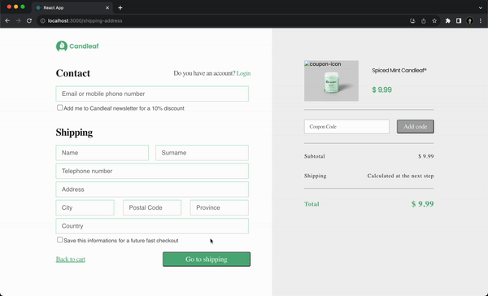
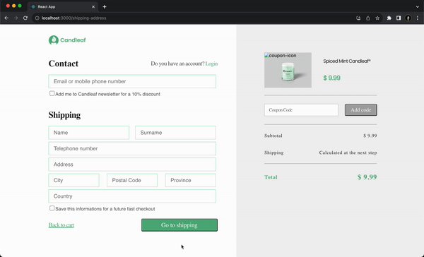
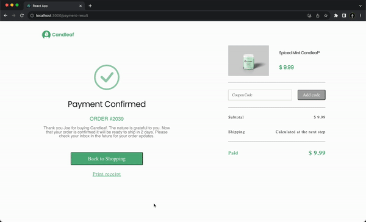
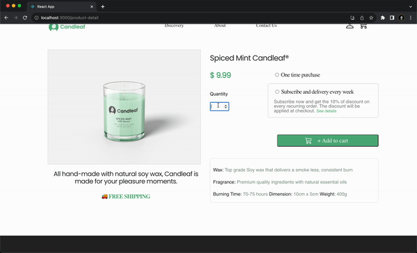

# E-Commerce Application by using React

This project is coded by using HTML, CSS and React. All HTML and CSS code is written by me from scratch.

<h2>Main Page</h2>

 
<h2>Login Register</h2>

 
<h2>Cart</h2>

 
<h2>Shipping</h2>

 
<h2>Payment</h2>

 
<h2>Payment Successful</h2>

 
<h2>Product Detail</h2>

 

